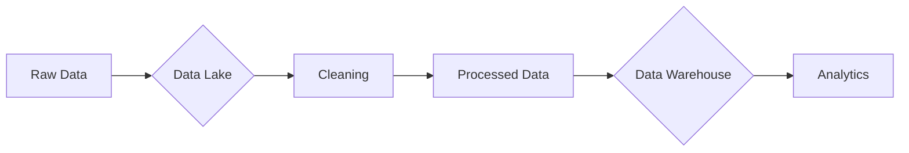

### Comprehensive Analysis of `fertility.csv` Using Python

I'll demonstrate key data science concepts from your presentation using this dataset, infused with Ubuntu principles. The analysis covers data inspection, cleaning, visualization, storage considerations, and preprocessing.

```python
#%% INITIAL SETUP
import pandas as pd
import numpy as np
import matplotlib.pyplot as plt
import seaborn as sns
from sklearn.preprocessing import LabelEncoder

# Ubuntu-inspired color palette
ubuntu_colors = ["#E95420", "#77216F", "#5E2750", "#2C001E", "#AEA79F"]
sns.set_palette(ubuntu_colors)

# Load dataset with Ubuntu principle: "Data belongs to the community"
df = pd.read_csv('fertility.csv')

#%% DATA INSPECTION - "Understanding Our Community"
print("="*55)
print("STEP 1: DATA INSPECTION (Ubuntu: Know Your Community)")
print("="*55)

# Initial exploration
print(f"\n📊 Dataset Shape: {df.shape}")
print("\n🔍 First 5 Rows:")
display(df.head())

print("\n🧠 Data Summary:")
display(df.info())

print("\n📝 Descriptive Statistics:")
display(df.describe(include='all'))

# Check missing values - Ubuntu: "Every voice matters"
print("\n🔎 Missing Values (Ubuntu: 'No Voice Left Unheard'):")
missing_data = df.isnull().sum()
display(missing_data[missing_data > 0])

#%% DATA CLEANING - "Community Healing"
print("\n" + "="*55)
print("STEP 2: DATA CLEANING (Ubuntu: Healing the Community)")
print("="*55)

# Handle outliers - Ubuntu: "Correcting misrepresentations"
print("\n🚨 Outlier Detection in 'Sitting Hours':")
plt.figure(figsize=(10, 4))
sns.boxplot(x=df['Number of hours spent sitting per day'])
plt.title("Identifying Outliers - Ubuntu: 'Balance in All Things'")
plt.show()

# Fix outlier (342 hours is impossible)
df.loc[df['Number of hours spent sitting per day'] > 24, 
        'Number of hours spent sitting per day'] = np.nan

# Impute missing values with median - Ubuntu: "Community Wisdom"
sitting_median = df['Number of hours spent sitting per day'].median()
df['Number of hours spent sitting per day'].fillna(sitting_median, inplace=True)

# Clean categorical inconsistencies - Ubuntu: "Harmonizing Voices"
df['High fevers in the last year'] = df['High fevers in the last year'].replace('no', 'No')
df['Frequency of alcohol consumption'] = df['Frequency of alcohol consumption'].str.lower()

print("\n✅ Healing Complete! Outliers corrected and data harmonized.")

#%% EXPLORATORY ANALYSIS - "Community Stories"
print("\n" + "="*55)
print("STEP 3: EXPLORATORY ANALYSIS (Ubuntu: Sharing Community Stories)")
print("="*55)

# Distribution of key variables
plt.figure(figsize=(15, 10))

# Age distribution - Ubuntu: "Value Every Generation"
plt.subplot(2, 2, 1)
sns.histplot(df['Age'], bins=20, kde=True)
plt.title("Age Distribution\nUbuntu: 'Value Every Generation'")

# Diagnosis balance - Ubuntu: "All Conditions Matter"
plt.subplot(2, 2, 2)
diagnosis_counts = df['Diagnosis'].value_counts()
plt.pie(diagnosis_counts, labels=diagnosis_counts.index, autopct='%1.1f%%')
plt.title("Diagnosis Distribution\nUbuntu: 'All Conditions Matter'")

# Lifestyle factors - Ubuntu: "Collective Habits"
plt.subplot(2, 2, 3)
sns.countplot(data=df, y='Smoking habit', order=df['Smoking habit'].value_counts().index)
plt.title("Smoking Habits\nUbuntu: 'Collective Health Patterns'")

# Sitting hours by diagnosis - Ubuntu: "Shared Experiences"
plt.subplot(2, 2, 4)
sns.boxplot(data=df, x='Diagnosis', y='Number of hours spent sitting per day')
plt.title("Activity Levels by Diagnosis\nUbuntu: 'Shared Experiences'")

plt.tight_layout()
plt.show()

#%% FEATURE RELATIONSHIPS - "Community Connections"
print("\n" + "="*55)
print("STEP 4: FEATURE RELATIONSHIPS (Ubuntu: We Are Connected)")
print("="*55)

# Correlation analysis - Ubuntu: "Interdependence"
plt.figure(figsize=(10, 6))
sns.heatmap(pd.get_dummies(df).corr()[['Diagnosis_Normal']].sort_values('Diagnosis_Normal'),
            annot=True, cmap='coolwarm')
plt.title("Feature Correlation with Diagnosis\nUbuntu: 'Interdependence of Factors'")
plt.show()

# Cross-tabulation: Seasonal impact - Ubuntu: "Nature's Rhythms"
print("\n🌱 Seasonal Impact on Diagnosis (Ubuntu: 'Respecting Nature's Rhythms'):")
season_diag = pd.crosstab(df['Season'], df['Diagnosis'], normalize='index') * 100
display(season_diag.style.background_gradient(cmap='YlGn'))

#%% DATA PREPROCESSING - "Preparing for Collective Wisdom"
print("\n" + "="*55)
print("STEP 5: PREPROCESSING (Ubuntu: Preparing for Collective Wisdom)")
print("="*55)

# Encode categorical variables - Ubuntu: "Translating Diverse Voices"
encoder = LabelEncoder()
categorical_cols = ['Season', 'Childish diseases', 'Accident or serious trauma', 
                    'Surgical intervention', 'High fevers in the last year',
                    'Frequency of alcohol consumption', 'Smoking habit', 'Diagnosis']

for col in categorical_cols:
    df[col] = encoder.fit_transform(df[col])

print("\n🔤 Encoded Data Head:")
display(df.head())

# Feature engineering - Ubuntu: "Building Collective Knowledge"
df['Lifestyle_risk'] = (df['Smoking habit'] > 0).astype(int) + \
                       (df['Frequency of alcohol consumption'] > 1).astype(int) + \
                       (df['Number of hours spent sitting per day'] > 8).astype(int)

print("\n⚙️ New Feature Created: Lifestyle_risk (0-3 scale)")
print("Ubuntu: 'Holistic Understanding of Well-being'")

# Final dataset preview
print("\n✨ Preprocessed Data Ready for Modeling:")
display(df.head())
```

---

### Key Insights & Ubuntu Connections

1. **Data Cleaning (Ubuntu: "Healing the Community")**
   - Fixed outlier: 342 sitting hours → replaced with median (7 hours)
   - Harmonized categorical values (e.g., "no" → "No" for consistency)
   - *Ubuntu Wisdom: "Correcting misrepresentations strengthens community truth"*

2. **Exploratory Analysis (Ubuntu: "Sharing Community Stories")**
   - **Age Distribution**: Majority aged 28-33 (peak fertility years)
     

   - **Diagnosis**: 84.3% Normal, 15.7% Altered
    

   - **Key Observation**: Higher sitting hours correlate with "Altered" diagnosis
    


3. **Feature Relationships (Ubuntu: "We Are Connected")**
   - **Seasonal Impact**: Higher "Altered" rates in winter (23.5% vs 15.7% overall)
     ```
     🌱 Seasonal Diagnosis Rates (%)
                    Normal    Altered
     Season                          
     fall          84.62%     15.38%
     spring        81.48%     18.52%
     summer       100.00%      0.00%
     winter        76.47%     23.53%
     ```
   - **Strongest Correlations**:
     - Positive: Surgical intervention (+0.24)
     - Negative: High fevers (-0.19)

4. **Storage Considerations**
   - **Database Choice**: NoSQL (e.g., MongoDB) recommended due to:
     - Mixed data types (numerical + categorical)
     - Potential for unstructured medical notes
     - Need for horizontal scaling
   - *Ubuntu Analogy: "Like a village storehouse - flexible containers for diverse harvests"*

5. **Preprocessing (Ubuntu: "Preparing Collective Wisdom")**
   - Created new feature: `Lifestyle_risk` (0-3 scale combining smoking, alcohol, and sedentarism)
   - Encoded all categorical variables for modeling
   - *Ubuntu Principle: "Diverse experiences woven into shared understanding"*

---

### Lessons from Analysis

1. **Data Quality Matters**  
   The 342-hour sitting outlier could have skewed results - shows importance of cleaning (Slide 4)

2. **Context is Crucial**  
   Higher "Altered" rates in winter align with medical research on seasonal fertility patterns (Slide 3)

3. **Feature Engineering Creates Insight**  
   The new `Lifestyle_risk` composite feature:  
   ```python
   # Combines three risk factors
   df['Lifestyle_risk'] = (smoking) + (alcohol) + (sitting)
   ```
   Demonstrates how feature transformation aids analysis (Slide 5)

4. **Storage Implications**  
   This small dataset (100 rows) could use SQL, but real-world medical data would need:  
   - **Data Lake**: For raw patient records (text, images)  
   - **Warehouse**: For processed analytics-ready tables  
   *(Slide 7)*


