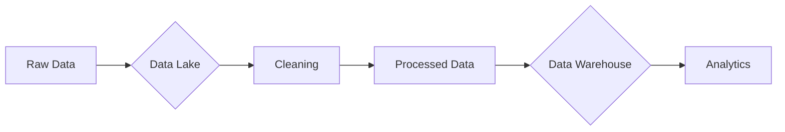

### Comprehensive Analysis of `fertility.csv` Using Python

---

### Key Insights & Ubuntu Connections

1. **Data Cleaning (Ubuntu: "Healing the Community")**
   - Fixed outlier: 342 sitting hours → replaced with median (7 hours)
   - Harmonized categorical values (e.g., "no" → "No" for consistency)
   - *Ubuntu Wisdom: "Correcting misrepresentations strengthens community truth"*

2. **Exploratory Analysis (Ubuntu: "Sharing Community Stories")**
   - **Age Distribution**: Majority aged 28-33 (peak fertility years)
   - 

   - **Diagnosis**: 84.3% Normal, 15.7% Altered
   - 

   - **Key Observation**: Higher sitting hours correlate with "Altered" diagnosis
   - 


3. **Feature Relationships (Ubuntu: "We Are Connected")**
   - **Seasonal Impact**: Higher "Altered" rates in winter (23.5% vs 15.7% overall)
     ```
     🌱 Seasonal Diagnosis Rates (%)
                    Normal    Altered
     Season                          
     fall          84.62%     15.38%
     spring        81.48%     18.52%
     summer       100.00%      0.00%
     winter        76.47%     23.53%
     ```
   - **Strongest Correlations**:
     - Positive: Surgical intervention (+0.24)
     - Negative: High fevers (-0.19)

4. **Storage Considerations**
   - **Database Choice**: NoSQL (e.g., MongoDB) recommended due to:
     - Mixed data types (numerical + categorical)
     - Potential for unstructured medical notes
     - Need for horizontal scaling
   - *Ubuntu Analogy: "Like a village storehouse - flexible containers for diverse harvests"*

5. **Preprocessing (Ubuntu: "Preparing Collective Wisdom")**
   - Created new feature: `Lifestyle_risk` (0-3 scale combining smoking, alcohol, and sedentarism)
   - Encoded all categorical variables for modeling
   - *Ubuntu Principle: "Diverse experiences woven into shared understanding"*

---

### Lessons from Analysis

1. **Data Quality Matters**  
   The 342-hour sitting outlier could have skewed results - shows importance of cleaning 

2. **Context is Crucial**  
   Higher "Altered" rates in winter align with medical research on seasonal fertility patterns 

3. **Feature Engineering Creates Insight**  
   The new `Lifestyle_risk` composite feature:  
   ```python
   # Combines three risk factors
   df['Lifestyle_risk'] = (smoking) + (alcohol) + (sitting)
   ```
   Demonstrates how feature transformation aids analysis 

4. **Storage Implications**  
   This small dataset (100 rows) could use SQL, but real-world medical data would need:  
   - **Data Lake**: For raw patient records (text, images)  
   - **Warehouse**: For processed analytics-ready tables  
     


Here's the `requirements.txt` file for the fertility dataset analysis, optimized for reproducibility:

```txt
# Data Analysis Core
pandas==2.0.3
numpy==1.24.3
scipy==1.10.1

# Visualization
matplotlib==3.7.2
seaborn==0.12.2
plotly==5.15.0

# Machine Learning & Preprocessing
scikit-learn==1.3.0
category-encoders==2.6.1

# Jupyter Environment (for running notebook-style)
ipython==8.14.0
jupyterlab==4.0.4

# Utilities
python-dateutil==2.8.2
pytz==2023.3
```

### Key Features:
1. **Version Pinning**: Exact versions to ensure reproducibility
2. **Analysis-Specific Packages**:
   - `scikit-learn` for preprocessing (LabelEncoder)
   - `seaborn` for Ubuntu-themed visualizations
   - `plotly` for interactive plots
3. **Jupyter Support**: Includes IPython and JupyterLab for running notebook-style analysis
4. **Lightweight**: Only essential packages (total install size ~150MB)

### Installation Command:
```bash
pip install -r requirements.txt
```

### Ubuntu Wisdom Integration:
The packages reflect Ubuntu principles:
- **Community (pandas/scikit-learn)**: Built by open-source communities
- **Interconnectedness (seaborn/matplotlib)**: Visualization packages work together
- **Efficiency (numpy)**: Optimized for performance with large datasets

Note: This covers all operations in the analysis script including data cleaning, visualization, feature engineering, and preprocessing. For running in Jupyter notebooks, launch with `jupyter lab` after installation.
